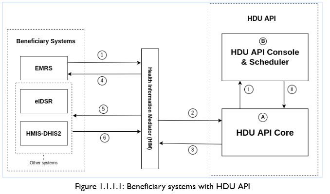
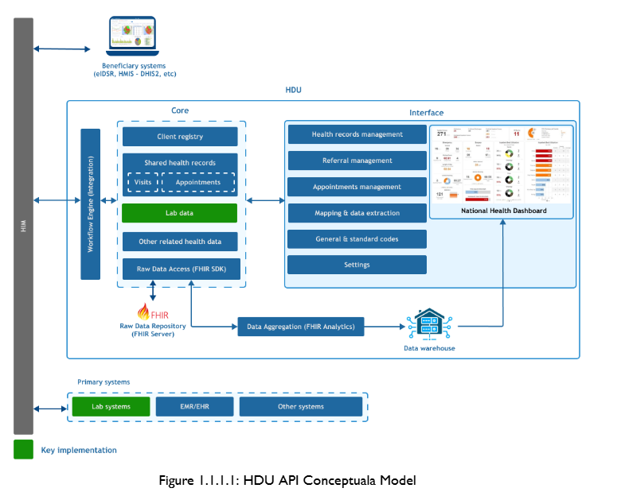
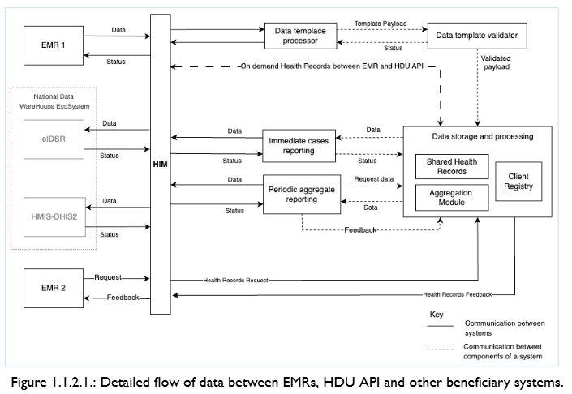

## Health Facility EMR/EHR TO Health Data Universal API
The Health Data Universal (HDU) API allows receiving data from health facilities (both public and private). HDU API is composed of four major modules, the Client Registry (CR), the Shared Health Records (SHR), the Integration module and the Dashboard module. Data sharing from health facilities is facilitated by a structured format of data (Data Template) that was created from MoH HMIS (MTUHA) registers variables used by all public and private health facilities.
To share data, the health facility EMR/EHR will generate a payload of patients/clients with different services provided at different locations (i.e IPD, OPD, Laboratory etc) using the Data Template standard and sent to the Health Information Mediator (HIM) and thereafter forwarded to the HDU API system.
HDU API system handles client registration across health facilities, storage of health records and being able to help facilities get health records across health facilities.
This document contains technical specifications to support the EMRs and other client-level health-related systems with national-level systems like HMIS-DHIS2, eIDSR etc integration.
# Architectural design & Business flow diagram
Figure 1 shows the architecture of HDU API with the interaction between EMR/EHR and beneficiary systems via HIM.
 

 
# HDU components and interacting systems
The following architecture shows different components of the HDU API system.
1. HDU API Core
   This is the engine of the HDU API. It serves the following purposes
   Defining data templates
   API for retrieving data templates
   Standard codes storage
   Centralization of systems mappings
   Validating and storing data templates from EMRS
   Daily data aggregation using stored mappings
   Periodic (weekly, monthly etc) data aggregation
   Pushing data to destination systems
   Periodic storage and cleaning of clients' records
   Communication with the Console for workflow processing
2. HDU API Console
   This component serves as a dynamic workflow processing engine. It serves the following:-
   Storing workflows
   Scheduling workflows
   Processing workflows
   Communication with HDU API Core to facilitate data requests
 
