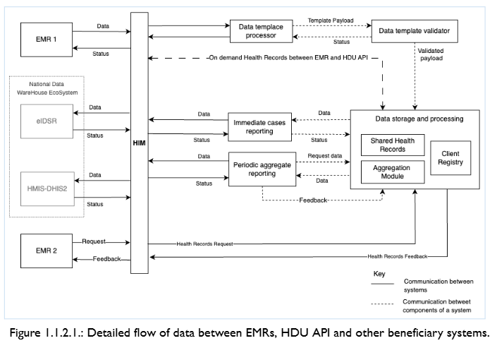

# Business Flow nd Data Processing

This section describes how data flows between EMRs, the HDU API, and beneficiary systems.

## Data Processing Flow

The data flow illustrates interactions between EMR/EHR systems, the HDU API, and other beneficiary systems.

The flow demonstrates the following processes:

- On-demand health record requests
- Immediate case reporting
- Periodic aggregate reporting
- Feedback loops between systems

## Data Exchange Specifications

### Transport Method (API)

The HDU API uses Web APIs for data exchange between systems:

- **EMR/EHR to HIM:** Web API
- **HIM to HDU API:** Web API

