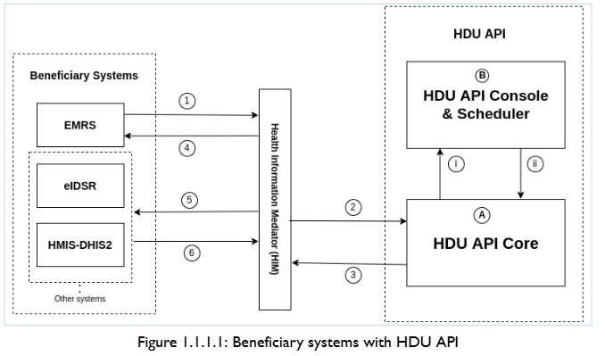

# System Architecture Overview

The HDU API architecture enables communication between health facility systems and national data warehouse ecosystems.

The architecture supports standardized, secure, and scalable data exchange between multiple health information systems.

## Architecture Overview

The general system architecture illustrates communication between the following components:

- EMR/EHR systems
- Health Information Mediator (HIM)
- HDU API
- Beneficiary systems such as HMIS-DHIS2, eIDSR, and others

This architecture ensures interoperability between facility-level systems and national health information platforms.

## Integration Channels and Core APIs

This section describes the main API channels used by EMR/EHR systems to communicate with the HDU ecosystem through the Health Information Mediator (HIM).

### Data Templates – HIM Channel

| Field        | Value |
|-------------|------|
| Channel     | VIA HIM |
| Method      | GET |
| API         | Data Template – HIM |
| Endpoint    | https://&lt;him-domain&gt;:&lt;port&gt;/emr-get-data-templates |
| Username    | xxxx |
| Password    | xxxx |

### Data Templates – HDU Channel

| Field        | Value |
|-------------|------|
| Channel     | VIA HIM |
| Method      | GET |
| API         | Data Template – HDU (All) |
| Endpoint    | https://&lt;him-domain&gt;:&lt;port&gt;/adapter/api/v1/dataTemplates |
| Username    | xxxxx |
| Password    | xxxxxx |

| Field        | Value |
|-------------|------|
| Channel     | VIA HIM |
| Method      | GET |
| API         | Data Template – HDU (Specific) |
| Endpoint    | https://&lt;him-domain&gt;:&lt;port&gt;/adapter/api/v1/dataTemplates?id=xxxxxxxx |
| Username    | xxxxx |
| Password    | xxxxxx |

### EMR to HIM Data Submission Channel

| Field        | Value |
|-------------|------|
| Channel     | EMR-HIM |
| Method      | POST |
| API         | EMR-HDU Data |
| Endpoint    | https://&lt;him-domain&gt;:&lt;port&gt;/emr-hdu-data |
| Username    | xxxxxx |
| Password    | xxxxxx |