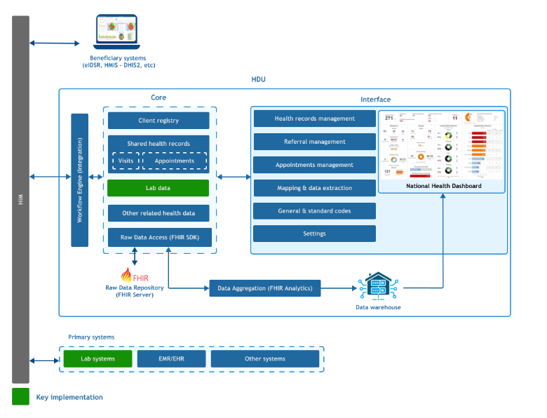

# About HDU

Health Data Universal (HDU) is a national interoperability platform developed to enable seamless exchange of health data between healthcare facilities and national health information systems in Tanzania.

The platform allows digital health systems used at healthcare facilities such as **Electronic Medical Records (EMR)**, **Electronic Health Records (EHR)**, and **Laboratory Information Systems**—to securely transmit standardized health data to national systems including the **Health Management Information System (HMIS)** implemented through **DHIS2** and other public health platforms.

By enabling structured data exchange, HDU supports improved reporting, data quality, and timely access to health information for decision-making.

## The Digital Health Landscape in Tanzania

Tanzania has made significant investments in digital health systems across healthcare facilities and national programs. These include:

- **Electronic Medical Record (EMR)** systems in hospitals and health facilities  
- The national **Health Management Information System (HMIS)** implemented using **DHIS2**  
- Disease surveillance systems such as **eIDSR**  
- Facility and referral management systems  

These platforms have improved data capture, reporting timeliness, and monitoring of healthcare services.

However, many of these systems were developed independently and operate using different data structures and standards.

## The Challenge: Fragmented Health Information Systems

Despite the availability of multiple digital health systems, health data often remained fragmented across platforms.

Common challenges included:

- Different coding standards for diagnoses, laboratory tests, and services  
- Inconsistent patient identifiers across systems  
- Manual aggregation of facility data for national reporting  
- Repeated mapping of indicators between systems  
- Limited real-time access to surveillance data  

These challenges increased the reporting burden on health workers and affected the quality and timeliness of national health statistics.

## The Need for an Interoperability Platform

To address these challenges, a centralized interoperability approach was required.

Instead of replacing existing systems, the goal was to:

- Allow healthcare systems to remain operationally independent  
- Standardize how health data is exchanged between systems  
- Improve consistency and quality of health information  
- Automate reporting to national health systems  
- Support real-time disease surveillance and monitoring  

This vision led to the creation of the **Health Data Universal (HDU)** platform.

## Role of HDU in the Digital Health Ecosystem

HDU acts as a bridge between facility-level systems and national health information platforms.

Healthcare systems generate structured health data which is transmitted through interoperability services and processed by the **HDU platform** before being shared with national systems.

This enables:

- Automated reporting  
- Standardized health data exchange  
- Improved interoperability between health systems  
- Better access to national health statistics  

## Core Capabilities of HDU

The HDU platform provides several core capabilities:

- Standardized health data exchange across systems  
- Validation and processing of health data from facilities  
- Secure storage of patient-level health records  
- Aggregation of health data for national reporting  
- Integration with national systems such as **DHIS2** and surveillance platforms  

Through these capabilities, HDU supports more efficient health data management and improved use of health information for planning and decision-making.