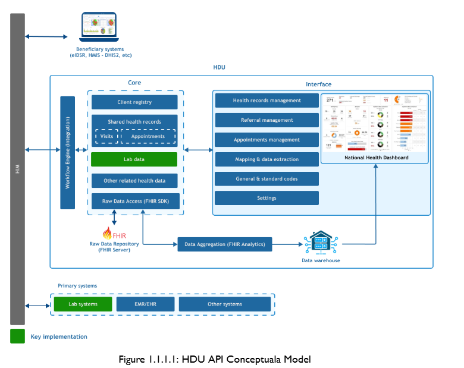

# Overview

The **Health Data Universal (HDU) API** allows receiving data from health facilities, both public and private.  
The HDU API is composed of four major modules:

- Client Registry (CR)
- Shared Health Records (SHR)
- Integration Module
- Dashboard Module

Data sharing from health facilities is facilitated by a structured data format called **Data Template** that was created from Ministry of Health HMIS (MTUHA) registers’ variables used by all public and private health facilities.

To share data, a health facility EMR/EHR generates a payload containing patients or clients with services provided across different service delivery points (e.g. IPD, OPD, Laboratory). This payload follows the Data Template standard and is sent to the **Health Information Mediator (HIM)**, which then forwards it to the HDU API system.

The HDU API system handles the following core functions:

- Client registration across health facilities
- Storage of health records
- Enabling facilities to retrieve health records across different health facilities

This documention contains technical specifications to support EMRs and other client-level health-related systems to integrate with national-level systems such as **HMIS-DHIS2**, **eIDSR**, and other beneficiary systems.

## Scope of This Documentation

This document provides technical integration guidance for the following systems:

- EMR/EHR systems
- Client-level health systems
- Laboratory Information Systems (LIMS)

The scope of this documentation includes:

- Data template structure and usage
- Client Registry integration
- Shared Health Records integration
- Standardized codes usage
- Error handling and validation

## Getting Started

### Prerequisite Knowledge

To successfully integrate with the HDU API, implementers are expected to have knowledge of:

- RESTful APIs
- JSON payload structures
- HTTP request methods (GET, POST, PUT, PATCH)
- Health information systems workflows
- Facility-based health data capture

### Integration Workflow

The integration workflow follows the sequence below:

**EMR/EHR → Health Information Mediator (HIM) → HDU API → Beneficiary Systems**

EMR/EHR systems generate data using standardized Data Templates. These templates are sent via Web APIs to the Health Information Mediator (HIM). The HIM forwards validated payloads to the HDU API Core for processing, storage, aggregation, and onward transmission to national systems.

## Authentication

All HDU API endpoints are secured using **Basic Authentication**.

Authentication credentials are issued to integrating systems and must be included in the request headers for every API call.

